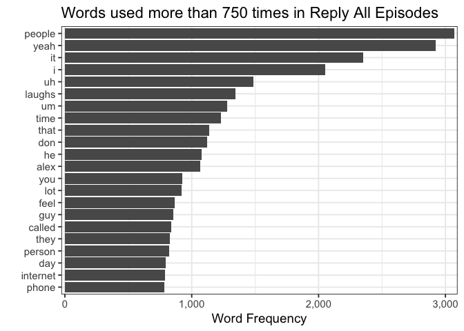
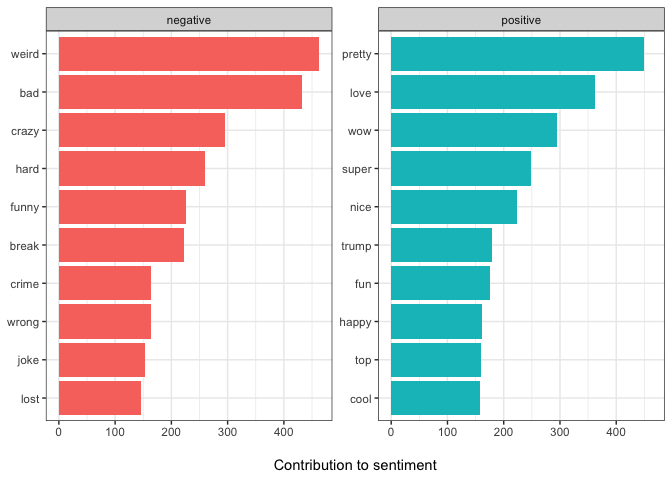

Reply All Text Analysis 2
================
Noah Landesberg
3/19/2018

# This is also an early draft

``` r
library(rvest) # for web scraping
library(dplyr) # for data tidying
library(stringr) # for working with strings
library(tidytext) # analyze text data!
library(ggplot2) # make nice plots
library(scales) # make plots even nicer
library(tidyr) # for data organization
library(purrr) # for iteration
```

Start by reading in our data (link to previous post) [link to
data](https://github.com/landesbergn/reply-all/blob/master/reply_all_text_data.csv).

``` r
tidy_ep_data <- readr::read_csv("https://github.com/landesbergn/reply-all/raw/master/reply_all_text_data.csv")
```

    ## Parsed with column specification:
    ## cols(
    ##   link = col_character(),
    ##   episode_number = col_double(),
    ##   full_link = col_character(),
    ##   speaker = col_character(),
    ##   linenumber = col_double(),
    ##   word = col_character()
    ## )

Looking at the word count, there are lot of boring words like ‘the’ or
‘and’ or ‘to’.

``` r
tidy_ep_data %>%
  group_by(word) %>%
  count(word, sort = TRUE) %>%
  head(10)
```

    ## # A tibble: 10 x 2
    ## # Groups:   word [10]
    ##    word      n
    ##    <chr> <int>
    ##  1 the   23932
    ##  2 and   21301
    ##  3 to    17538
    ##  4 i     16974
    ##  5 a     16750
    ##  6 like  13883
    ##  7 that  13412
    ##  8 you   12786
    ##  9 of    12560
    ## 10 it    10341

We can import the “stop\_words” data set from the `tidytext` package.

``` r
data("stop_words")
head(stop_words)
```

    ## # A tibble: 6 x 2
    ##   word      lexicon
    ##   <chr>     <chr>  
    ## 1 a         SMART  
    ## 2 a's       SMART  
    ## 3 able      SMART  
    ## 4 about     SMART  
    ## 5 above     SMART  
    ## 6 according SMART

``` r
# remove stop words with an anti_join
tidy_ep_data_clean <- tidy_ep_data %>%
  anti_join(stop_words) %>% 
  mutate(word = str_extract(word, "[a-z']+")) %>% 
  filter(!is.na(word))
```

    ## Joining, by = "word"

``` r
# quick check of the top words accross all episodes
tidy_ep_data_clean %>%
  group_by(word) %>%
  count(word, sort = TRUE) %>%
  head(10)
```

    ## # A tibble: 10 x 2
    ## # Groups:   word [10]
    ##    word       n
    ##    <chr>  <int>
    ##  1 people  3068
    ##  2 yeah    2925
    ##  3 it      2350
    ##  4 i       2054
    ##  5 uh      1484
    ##  6 laughs  1344
    ##  7 um      1281
    ##  8 time    1230
    ##  9 that    1139
    ## 10 don     1123

``` r
# plot words used 500 times
tidy_ep_data_clean %>% 
  group_by(word) %>%
  count(word, sort = TRUE) %>%
  filter(n >= 750) %>%
  ggplot(aes(x = reorder(word, n), y = n)) +
    geom_bar(stat = "identity") +
    coord_flip() +
    scale_y_continuous(labels = scales::comma_format(), expand = c(0.009,0)) +
    labs(
      title = "Words used more than 750 times in Reply All Episodes",
      x = "",
      y = "Word Frequency"
    ) +
    theme_bw(base_size = 14) 
```

<!-- -->

``` r
# Compare word frequency
frequency <- tidy_ep_data_clean %>%
  filter(speaker %in% c("ALEX GOLDMAN", "PJ VOGT")) %>%
  count(speaker, word) %>%
  group_by(speaker) %>%
  mutate(proportion = n / sum(n)) %>%
  select(-n) %>%
  spread(speaker, proportion)

# Compare word frequency plot
ggplot(frequency, aes(x = `PJ VOGT`, y = `ALEX GOLDMAN`, color = abs(`ALEX GOLDMAN` - `PJ VOGT`))) +
  geom_abline(color = "gray40", lty = 2) +
  geom_jitter(alpha = 0.1, size = 2.5, width = 0.3, height = 0.3) +
  geom_text(aes(label = word), check_overlap = TRUE, vjust = 1.5) +
  scale_x_log10(labels = percent_format()) +
  scale_y_log10(labels = percent_format()) +
  scale_color_gradient(limits = c(0, 0.001), low = "darkslategray4", high = "gray75") +
  theme_bw(base_size = 16) +
  theme(legend.position = "none") +
  labs(y = "Alex", x = "PJ", title = "Comparing word frequencies of PJ and Alex")
```

    ## Warning: Removed 8848 rows containing missing values (geom_point).

    ## Warning: Removed 8848 rows containing missing values (geom_text).

<!-- -->

``` r
sentiment_data <- tidy_ep_data_clean %>%
  inner_join(get_sentiments("bing")) %>%
  count(episode_number, index = linenumber %/% 5, sentiment) %>%
  spread(sentiment, n, fill = 0) %>%
  mutate(sentiment = positive - negative)
```

    ## Joining, by = "word"

``` r
ggplot(sentiment_data, aes(index, sentiment)) +
  geom_line(show.legend = FALSE) +
  geom_hline(yintercept = 0) +
  facet_wrap(~episode_number, scales = "free_x")
```

<!-- -->

``` r
# contribution to sentiment
bing_word_counts <- tidy_ep_data_clean %>%
  inner_join(get_sentiments("bing")) %>%
  count(word, sentiment, sort = TRUE) %>%
  ungroup()
```

    ## Joining, by = "word"

``` r
bing_word_counts %>%
  group_by(sentiment) %>%
  top_n(10) %>%
  ungroup() %>%
  mutate(word = reorder(word, n)) %>%
  ggplot(aes(word, n, fill = sentiment)) +
  geom_col(show.legend = FALSE) +
  facet_wrap(~sentiment, scales = "free_y") +
  labs(
    y = "\nContribution to sentiment",
    x = NULL
    ) +
  coord_flip() +
  theme_bw()
```

    ## Selecting by n

<!-- -->
